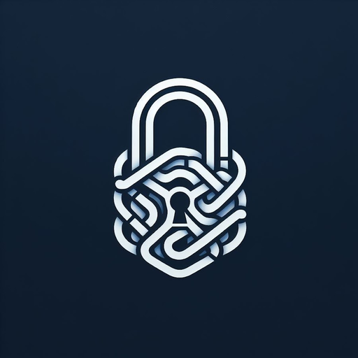

<p align="center">
  
</p>

# AppSec Untangled Resources

Security code review resources from the
[AppSec Untangled](https://medium.com/appsec-untangled) blog and YouTube
channel: an application security wiki, and Claude Code skills that review code
against it and walk you through how it works.

## 📖 The wiki

**<https://mohamed-osama-aboelkheir.github.io/appsec-untangled-resources/>**

- [The methodology](https://mohamed-osama-aboelkheir.github.io/appsec-untangled-resources/methodology/) — how to run a threat-model-first review, end to end, over one pull request
- [The threats](https://mohamed-osama-aboelkheir.github.io/appsec-untangled-resources/threats/) — 14 threats in two categories, each with criteria, attack, mitigation, per-stack code and the bypasses worth checking
- [Using the skill](https://mohamed-osama-aboelkheir.github.io/appsec-untangled-resources/using-the-skill/) — running the same method as a Claude Code skill
- [Example report](https://mohamed-osama-aboelkheir.github.io/appsec-untangled-resources/example-report.html) — what a finished review looks like

## 🤖 The skills

```
/plugin marketplace add mohamed-osama-aboelkheir/appsec-untangled-resources
/plugin install appsec-skills@appsec-untangled
```

### secure-code-review

Reviews a pull request, commit or diff against the wiki: it builds the story of
the change, lists entry points and dangerous sinks, picks the threats that
apply, checks each mitigation against the code, and writes a Markdown and HTML
report with evidence.

From the repository you want reviewed:

```
/appsec-skills:secure-code-review 128          # a pull request
/appsec-skills:secure-code-review HEAD         # a commit
/appsec-skills:secure-code-review main..HEAD   # a range
```

It reads only the wiki example files matching the project's stack, so a review
costs about the same context however far the wiki grows. It does not attempt
exploitation, and does not look up the project's known vulnerabilities — the
report shows what the method finds from the code alone.

### code-walkthrough

Explains how a flow works, so you understand the code instead of trusting a
verdict. Give it a route, a feature or a code location (a scanner finding's
sink, for example): it finds the routes that reach it, runs the app locally to
capture real responses, and writes, for each flow, a Mermaid sequence diagram
and a matching [CodeTour](https://marketplace.visualstudio.com/items?itemName=vsls-contrib.codetour)
for VS Code. Step N in the tour is step N in the diagram, and each tour step
highlights the exact code it describes.

```
/appsec-skills:code-walkthrough GET /orders
/appsec-skills:code-walkthrough src/repositories/orderRepository.js:8
/appsec-skills:code-walkthrough the node-postgres-sqli findings in semgrep.json
```

It writes one spec per flow (`docs/flows/<id>.flow.json`) and generates the
tour (`.tours/`) and the diagram page (`docs/flows/<id>.md`) from it, so the
two never drift apart. Tour steps are anchored on code patterns, not line
numbers: after the code changes, rebuild and the highlights follow it.

### source-to-sink

Traces data between sources and dangerous sinks, like a SAST dataflow trace,
and shows it so you can check it yourself. **Backward** from a sink (a
file:line or a scanner finding): which sources reach it, is any of them user
input, and who can send it. **Forward** from an input: which sinks it reaches,
or where it stops. Forward mode uses the wiki's source-to-sink threat pages as
its sink catalogue.

```
/appsec-skills:source-to-sink src/repositories/orderRepository.js:10
/appsec-skills:source-to-sink the node-postgres-sqli findings in semgrep.json
/appsec-skills:source-to-sink req.query.file on GET /exports
```

Each trace is a diagram of code cards, one chain per source, top to bottom:
the line of code at every hop with the value in bold, arrows named after the
value (`sort → orderColumn`), coloured by the source's origin (user input,
config, constant, stored data…), ending in the sink. Controls on the path are
shown as side cards, including the ones that don't cover the value. A matching
CodeTour highlights just the value on each line. It classifies sources but
gives no exploitability verdict or severity: that's a triage decision, and the
trace is its evidence.

### semgrep-triage

Turns scanner findings into decisions you can check. For each finding it traces
the flagged value back to its sources (with `source-to-sink`), checks the
controls on the path against the wiki's mitigations and *Bypasses to check*,
and decides true or false positive, severity (impact × likelihood, compared
with the scanner's) and confidence.

```
/appsec-skills:semgrep-triage semgrep.json
/appsec-skills:semgrep-triage semgrep.json --learn     # you decide first, then compare
```

It writes one Markdown report (lists, no tables). Every finding gets its
source-to-sink diagram and CodeTour, the evidence, and collapsed
**Manual Reproduction** steps with the exact files, searches and harmless local
requests to repeat the analysis. True positives get a **Suggested fix** (code,
why it holds, how to verify it, tested on a scratch copy when the app runs).
False positives get what would make them real, and a **rule decision**:
disable the rule for the repo, or keep it and suppress this instance. It never
changes the application or writes attack payloads, and keeps findings private.

## Layout

```
.claude-plugin/marketplace.json     the marketplace
plugins/appsec-skills/
├── skills/secure-code-review/      review skill, its report templates and renderer
├── skills/code-walkthrough/        walkthrough skill, its spec reference and generator
├── skills/source-to-sink/          dataflow trace skill, its spec reference and generator
├── skills/semgrep-triage/          triage skill, its report template and helper script
├── lib/tours.mjs                   CodeTour helpers shared by the two generators
└── wiki/
    ├── docs/                       the website: methodology, threats, guides
    └── examples/                   per-technology code examples, included into the threat pages
zensical.toml                       website build
```

The wiki lives inside the plugin because a Claude Code plugin can only read
files in its own directory — so the skill and the site are always the same
content.

## Contributing

Adding a stack example, or a threat, is a small pull request. See
[CONTRIBUTING.md](CONTRIBUTING.md) for the page format, the naming rules and
the checks to run.

## License

[MIT](LICENSE)
