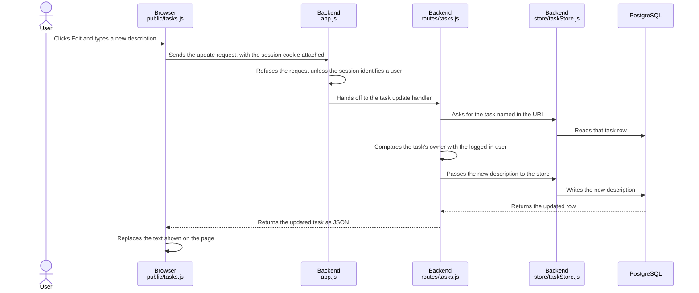

<!--
Security review report template (Markdown).
Follows the threat-model-first methodology, in the same order as the talk:
  1 Scope and story → 2 Entry points → 3 Dangerous sinks → 4 Threat model
  → 5 Mitigation analysis (exploitability + fix live inside each threat card)
  → 6 Action items
Filled in with the dummy "edit task description" PR from the slides.
Links point to a dummy repository (example-org/todo-app).
-->

# 🔐 Security review: PR #128, "Add button to edit a task's description"

| | |
|---|---|
| **Repository** | [example-org/todo-app](https://github.com/example-org/todo-app) |
| **Pull request** | [#128](https://github.com/example-org/todo-app/pull/128) by `alice` · `edit-task` → `main` |
| **Commit reviewed** | [`9f3c2ab`](https://github.com/example-org/todo-app/commit/9f3c2ab4d1e8) |
| **Changes** | 4 files · +32 −1 |
| **Reviewed** | 2026-09-14 · Claude Code security-review skill · Human verification: ☐ pending |

## Summary

**Verdict: ✅ Approve, with 1 hardening recommendation**

This PR lets users edit a task's description from the task list, through a new `PUT /api/tasks/:id` route. Authentication, the ownership check, safe rendering in the page and parameterized SQL are all in place. CSRF protection relies on browser behavior rather than an explicit control, so we recommend setting `SameSite` on the session cookie ([A1](#action-items)).

| # | Threat | Category | Status | Severity |
|---|---|---|---|---|
| [T1](#t1) | Missing authentication | 🔓 Business logic | ✅ Mitigated | — |
| [T2](#t2) | Missing authorization (IDOR) | 🔓 Business logic | ✅ Mitigated | — |
| [T3](#t3) | Missing CSRF protection | 🔓 Business logic | ⚠️ Partially mitigated | Low |
| [T4](#t4) | Cross-site scripting (XSS) | 💉 Source to sink | ✅ Mitigated | — |
| [T5](#t5) | SQL injection | 💉 Source to sink | ✅ Mitigated | — |

**Status legend:** ✅ Mitigated · ⚠️ Partially mitigated · ❌ Not mitigated · ❓ Needs verification

---

## 1. 🗺️ Scope and architecture

### Goal of the PR

Users can currently add and complete tasks but not change their text. This PR adds an **Edit** button next to each task. Clicking it asks for a new description, saves it, and updates the page without a reload.

### What changed

| File | Change | Purpose |
|---|---|---|
| [`public/index.html`](https://github.com/example-org/todo-app/blob/9f3c2ab/public/index.html#L13) | +1 | Adds the Edit button to each task |
| [`public/tasks.js`](https://github.com/example-org/todo-app/blob/9f3c2ab/public/tasks.js#L23-L34) | +12 | `editTask()`: prompts, sends the request, updates the page |
| [`routes/tasks.js`](https://github.com/example-org/todo-app/blob/9f3c2ab/routes/tasks.js#L31-L39) | +10 | New `PUT /api/tasks/:id` route with an ownership check |
| [`store/taskStore.js`](https://github.com/example-org/todo-app/blob/9f3c2ab/store/taskStore.js#L18-L26) | +9 −1 | New `update()` function and export |

**Relevant code outside the diff:** [`app.js`](https://github.com/example-org/todo-app/blob/9f3c2ab/app.js#L1-L11), where sessions and `requireAuth` are set up, and `store.get()`.

**Tech stack:** Node.js with Express and `express-session`, PostgreSQL through `pg`, plain JavaScript in the browser.
**Roles:** the task owner (logged in), other logged-in users, anonymous visitors.

### The story: what happens when a user clicks Edit

Each step says what happens; the code it happens in is attached to the step.



### Controls in this flow

**Step 1 — the button that starts it** (`U->>B` in the diagram)

```html
// public/index.html
13  <button onclick="editTask(42)">Edit</button>
```

🔗 [`public/index.html#L13`](https://github.com/example-org/todo-app/blob/9f3c2ab/public/index.html#L13)

**Step 2 — what actually arrives** (`B->>A` in the diagram)

```http
# HTTP request
PUT /api/tasks/42 HTTP/1.1
Host: todo.example.com
Cookie: connect.sid=s%3AkF9x...
Content-Type: application/json

{"description": "Buy oat milk"}
```

**Step 3 — the authentication gate** (`A->>A` in the diagram)

```js
// app.js
 5  function requireAuth(req, res, next) {
 6    if (!req.session.userId) return res.sendStatus(401)
 7    next()
 8  }
11  app.use('/api/tasks', requireAuth, tasksRouter)
```

🔗 [`app.js#L5-L11`](https://github.com/example-org/todo-app/blob/9f3c2ab/app.js#L5-L11)

**Step 5 — the read** (`R->>S` in the diagram)

```js
// store/taskStore.js
11  async function get(id) {
12    const { rows } = await db.query(
13      'SELECT * FROM tasks WHERE id = $1', [id])
14    return rows[0]
15  }
```

🔗 [`store/taskStore.js#L11-L15`](https://github.com/example-org/todo-app/blob/9f3c2ab/store/taskStore.js#L11-L15)

**Step 7 — the ownership check** (`R->>R` in the diagram)

```js
// routes/tasks.js
32    const task = await store.get(req.params.id)
33    if (task?.owner_id !== req.session.userId) {
34      return res.sendStatus(404)
35    }
```

🔗 [`routes/tasks.js#L32-L35`](https://github.com/example-org/todo-app/blob/9f3c2ab/routes/tasks.js#L32-L35)

**Step 8 — the write** (`R->>S` in the diagram)

```js
// store/taskStore.js
19    const { rows } = await db.query(
20      `UPDATE tasks SET description = $1
21       WHERE id = $2 RETURNING *`,
22      [description, id])
```

🔗 [`store/taskStore.js#L19-L22`](https://github.com/example-org/todo-app/blob/9f3c2ab/store/taskStore.js#L19-L22)

**Step 11 — what goes back** (`R-->>B` in the diagram)

```http
# HTTP response
HTTP/1.1 200 OK
Content-Type: application/json

{"id": 42, "owner_id": 7, "description": "Buy oat milk"}
```

**Step 12 — how it reaches the page** (`B->>B` in the diagram)

```js
// public/tasks.js
33    document.getElementById(`desc-${id}`).textContent = task.description
```

🔗 [`public/tasks.js#L33`](https://github.com/example-org/todo-app/blob/9f3c2ab/public/tasks.js#L33)

### Assumptions and out of scope

- No CORS middleware is configured, so the API accepts only same-origin browser requests.
- Creating, completing and deleting tasks are unchanged and out of scope.

---

## 2. 🚪 Entry points

| # | Entry point | Authentication | Action performed | Sensitivity | Location |
|---|---|---|---|---|---|
| EP1 | `PUT /api/tasks/:id` | Session cookie | Rewrites one task's description | Medium — private user content, single record, reversible | [`routes/tasks.js#L31`](https://github.com/example-org/todo-app/blob/9f3c2ab/routes/tasks.js#L31) |

### EP1 · `PUT /api/tasks/:id`

| | |
|---|---|
| **Action performed** | Replaces the description text of one existing task |
| **Inputs** | `id` (URL path, integer) · `description` (JSON body, string, no length limit) |
| **Outputs** | The updated task: `id`, `owner_id`, `description` |
| **Data sensitivity** | Task text is private user content. No PII, credentials or payment data. `owner_id` is returned, which discloses an internal user ID to its owner only |
| **Action sensitivity** | Write to a single record, reversible by the owner. Not financial, not destructive, no side effects outside the row |
| **Authentication** | Session cookie, enforced by `requireAuth` on the router mount |
| **Authorization model** | Per-record ownership: `tasks.owner_id` must equal the session user. This app has no tenants, organizations, groups, roles, permissions or feature flags — ownership is the only dimension |
| **Location** | [`routes/tasks.js#L31-L39`](https://github.com/example-org/todo-app/blob/9f3c2ab/routes/tasks.js#L31-L39) |

**Who should be able to do this**

- ✅ The task's owner, in an authenticated session started by them.
- ❌ Any other logged-in user, whether or not they know the task ID.
- ❌ Anonymous callers.
- ❌ Another origin acting through the victim's browser and cookie, even with the owner logged in.
- ❌ Nobody can change `owner_id` through this route; ownership transfer is not a feature of this app.

The Edit button and `prompt()` in the browser collect the description, but the server can't trust them: any client can call EP1 directly.

---

## 3. 🎯 Dangerous sinks

| # | Sink | Type | Reached by | Location |
|---|---|---|---|---|
| SK1 | `db.query(UPDATE …)` | SQL query | `description`, `id` | [`store/taskStore.js#L19-L22`](https://github.com/example-org/todo-app/blob/9f3c2ab/store/taskStore.js#L19-L22) |
| SK2 | `.textContent = …` | Page update (DOM) | `description` (from the response) | [`public/tasks.js#L33`](https://github.com/example-org/todo-app/blob/9f3c2ab/public/tasks.js#L33) |

---

## 4. 🧩 Threat model

### 🔓 Business logic: controls that should be there, checked at every entry point

| # | Entry point | Threat | Expected mitigation | Status |
|---|---|---|---|---|
| [T1](#t1) | EP1 | Missing authentication | A logged-in session is required | ✅ |
| [T2](#t2) | EP1 | Missing authorization (IDOR) | Only the task's owner can edit it | ✅ |
| [T3](#t3) | EP1 | Missing CSRF protection | Cross-site requests can't change data | ⚠️ |

### 💉 Source to sink: input that shouldn't reach a sink, checked at every sink

| # | Sink | Threat | Expected mitigation | Status |
|---|---|---|---|---|
| [T4](#t4) | SK2 | Cross-site scripting (XSS) | The description is inserted as text, not HTML | ✅ |
| [T5](#t5) | SK1 | SQL injection | The query uses parameters | ✅ |

---

## 5. 🔍 Mitigation analysis

<a id="t1"></a>

### T1 · Missing authentication · ✅ Mitigated

**Category:** 🔓 Business logic · **Entry point:** EP1

**Justification:** All `/api/tasks` routes are mounted behind `requireAuth`, which returns `401` when there's no session, so the new route can't be reached anonymously.

```js
// app.js (unchanged by this PR)
 5  function requireAuth(req, res, next) {
 6    if (!req.session.userId) {
 7      return res.sendStatus(401)
 8    }
 9    next()
10  }
11  app.use('/api/tasks', requireAuth, tasksRouter)
```

🔗 [`app.js#L5-L11`](https://github.com/example-org/todo-app/blob/9f3c2ab/app.js#L5-L11)

<details>
<summary><b>Detailed analysis, repro steps and evidence</b></summary>

**Trace:** EP1 → `app.js` L11 mounts `tasksRouter` behind `requireAuth` → L6 checks `req.session.userId` → the handler at `routes/tasks.js` L31 only runs after `next()`.

**Checked:**
- `requireAuth` runs before the router, because middleware runs in the order it's registered.
- No other code mounts `tasksRouter` or defines `/api/tasks` routes without `requireAuth`.

**Repro (confirms the control):**

```bash
curl -i -X PUT https://todo.example.com/api/tasks/42 \
  -H 'Content-Type: application/json' \
  -d '{"description": "no session"}'
```

**Evidence:**

```http
HTTP/1.1 401 Unauthorized
```

</details>

<a id="t2"></a>

### T2 · Missing authorization (IDOR) · ✅ Mitigated

**Category:** 🔓 Business logic · **Entry point:** EP1

**Justification:** The handler loads the task and returns `404` unless its `owner_id` matches the logged-in user, before calling `store.update()`.

```js
// routes/tasks.js
31  router.put('/:id', async (req, res) => {
32    const task = await store.get(req.params.id)
33    if (task?.owner_id !== req.session.userId) {
34      return res.sendStatus(404)
35    }
36    const updated = await store.update(
37      task.id, req.body.description)
38    res.json(updated)
39  })
```

🔗 [`routes/tasks.js#L31-L39`](https://github.com/example-org/todo-app/blob/9f3c2ab/routes/tasks.js#L31-L39)

<details>
<summary><b>Detailed analysis, repro steps and evidence</b></summary>

**Trace:** EP1 → `store.get(req.params.id)` → ownership check at L33 → `store.update()` at L36 uses the loaded `task.id`, not the raw URL value.

**Checked:**
- A missing task and someone else's task both return `404`, so the response doesn't reveal which task IDs exist.
- `task?.owner_id` handles a missing task without throwing.
- `owner_id` and `session.userId` are both numbers, so the strict `!==` comparison behaves as intended.

**Repro (confirms the control):**
1. Log in as `bob` (user 8).
2. Send a request for task 42, which belongs to `alice` (user 7):

```bash
curl -i -X PUT https://todo.example.com/api/tasks/42 \
  -H 'Cookie: connect.sid=<bob session>' \
  -H 'Content-Type: application/json' \
  -d '{"description": "edited by bob"}'
```

**Evidence:**

```http
HTTP/1.1 404 Not Found
```

Task 42's description is unchanged in the database.

</details>

<a id="t3"></a>

### T3 · Missing CSRF protection · ⚠️ Partially mitigated · Severity: Low

**Category:** 🔓 Business logic · **Entry point:** EP1

**Justification:** There's no CSRF token and the session cookie has no `SameSite` attribute. Cross-site requests are blocked today only because a `PUT` with a JSON body triggers a CORS preflight that the server doesn't approve. That protection disappears if the route ever accepts `POST` or form bodies, or if CORS is enabled with credentials.

```js
// app.js (unchanged by this PR)
 4  app.use(session({ secret: SECRET }))
```

🔗 [`app.js#L4`](https://github.com/example-org/todo-app/blob/9f3c2ab/app.js#L4)

#### 💥 Exploitability

Not exploitable as the code stands. An attacker would need the victim to be logged in and to visit a page they control, and would need the route to accept a request the browser sends cross-site — today it doesn't, because a `PUT` with a JSON body is preflighted and the preflight is refused. No resource ID is needed to try, since the attacker can guess task IDs, and no account on the app is required.

#### 🛠️ Suggested fix

Set the cookie attributes so the browser never sends the session cookie cross-site, rather than relying on the preflight.

```diff
- app.use(session({ secret: SECRET }))
+ app.use(session({
+   secret: SECRET,
+   cookie: { httpOnly: true, secure: true, sameSite: 'lax' },
+ }))
```

- `secure: true` requires HTTPS. Behind a proxy, also set `app.set('trust proxy', 1)`.
- For defense in depth, add a CSRF token check on state-changing routes.
- **Verify:** log in and confirm `Set-Cookie` includes `SameSite=Lax; Secure; HttpOnly`.

<details>
<summary><b>Detailed analysis, repro steps and evidence</b></summary>

**Trace:** EP1 authenticates with the `connect.sid` cookie alone → the browser attaches that cookie to any request to the site it's allowed to send, including requests started by another site.

**Checked:**
- No CSRF middleware or token check anywhere in the request path.
- Session cookie options are the defaults: no `SameSite`, no `Secure`.
- No CORS middleware, so preflight requests don't get `Access-Control-Allow-*` headers.
- Browsers always preflight a cross-site `PUT` with `Content-Type: application/json`.

**How to verify:** from a page on another origin, call the route with the victim's session and observe whether the request is sent at all. Not executed in this review.

**Evidence:** none gathered; this finding is from code alone.

</details>

<a id="t4"></a>

### T4 · Cross-site scripting (XSS) · ✅ Mitigated

**Category:** 💉 Source to sink · **Sink:** SK2

**Justification:** The description from the response is written with `.textContent`, so the browser shows it as text and never parses it as HTML.

```js
// public/tasks.js
32    const task = await res.json()
33    document.getElementById(`desc-${id}`).textContent = task.description
```

🔗 [`public/tasks.js#L32-L33`](https://github.com/example-org/todo-app/blob/9f3c2ab/public/tasks.js#L32-L33)

<details>
<summary><b>Detailed analysis, repro steps and evidence</b></summary>

**Trace:** `description` (EP1 body) → stored by SK1 → returned in the `200` response → written at L33 with `.textContent`.

**Checked:**
- The new code has no `innerHTML`, `outerHTML`, `insertAdjacentHTML` or `document.write`.
- The element's ID is built from `id`, the numeric task ID passed from the button, not from user text.

**Repro (confirms the control):**
1. Edit a task and enter `` as the description.
2. Watch the task list.

**Evidence:** the task shows the literal text ``, and no alert appears.

</details>

<a id="t5"></a>

### T5 · SQL injection · ✅ Mitigated

**Category:** 💉 Source to sink · **Sink:** SK1

**Justification:** `description` and `id` are passed to PostgreSQL as parameters (`$1`, `$2`), never concatenated into the SQL text.

```js
// store/taskStore.js
18  async function update(id, description) {
19    const { rows } = await db.query(
20      `UPDATE tasks SET description = $1
21       WHERE id = $2 RETURNING *`,
22      [description, id])
23    return rows[0]
24  }
```

🔗 [`store/taskStore.js#L18-L24`](https://github.com/example-org/todo-app/blob/9f3c2ab/store/taskStore.js#L18-L24)

<details>
<summary><b>Detailed analysis, repro steps and evidence</b></summary>

**Trace:** `req.body.description` (EP1) → `store.update(task.id, description)` → `db.query` with a fixed SQL string and a parameter array.

**Checked:**
- The SQL text is a constant; the template literal has no `${…}` placeholders.
- `id` comes from the task already loaded from the database (T2), not straight from the URL.

**Repro (confirms the control):**

```bash
curl -i -X PUT https://todo.example.com/api/tasks/42 \
  -H 'Cookie: connect.sid=<alice session>' \
  -H 'Content-Type: application/json' \
  -d "{\"description\": \"x', owner_id = 1 --\"}"
```

**Evidence:**

```http
HTTP/1.1 200 OK

{"id": 42, "owner_id": 7, "description": "x', owner_id = 1 --"}
```

The payload is stored as plain text, and `owner_id` is unchanged.

</details>

---

## 6. ✅ Action items

Everything that needs a decision, in one place. Each links to the threat it came from.

| # | Action | Threat | Status | Severity | Priority | Effort |
|---|---|---|---|---|---|---|
| A1 | Set `httpOnly`, `secure` and `sameSite: 'lax'` on the session cookie | [T3](#t3) | ⚠️ Partially mitigated | Low | Hardening — before the route accepts other content types | Small |

**Nothing to do for** [T1](#t1), [T2](#t2), [T4](#t4) and [T5](#t5): the controls are in place and were checked against the code.
