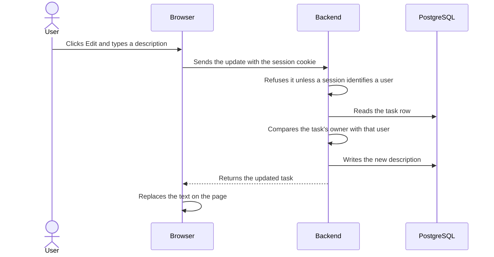

# The methodology

Most reviews start by reading a diff and hoping something looks wrong. This one
starts by deciding what the change *should* protect, then checks whether the
code does it. Threats you never named are threats you won't notice.

## The methodology at a glance

1. 🗺️ **Understand the scope and architecture**
   What it does, its roles, its tech stack, and how the pieces fit together.

2. 🚪 **Identify the entry points**
   Every place user input enters: web pages, forms, backend routes.

3. 🎯 **Identify the dangerous sinks**
   Where input could change behaviour: SQL queries, HTML/DOM, OS commands, templates.

4. 🧩 **Build a threat model**
    - 🔓 **Business logic** — missing controls, at every entry point
    - 💉 **Source to sink** — injection, at every dangerous sink

5. 🔍 **Review mitigations**
   For each threat: is it mitigated in the code, and how and where?
    - 💥 **Exploitability** — for anything not fully mitigated: who could abuse it, and what they would need
    - 🛠️ **Suggested fix** — the smallest change that closes it, and how to verify

Step 4 is the heart of it. The rest exists to make step 4 possible.

## The example: one pull request

**#128 · Add button to edit a task's description** — `alice` wants to merge
`edit-task` into `main`. Four files, +32 −1.

| File | Change | Purpose |
|---|---|---|
| `public/index.html` | +1 | Adds the Edit button to each task |
| `public/tasks.js` | +12 | `editTask()`: prompts, sends the request, updates the page |
| `routes/tasks.js` | +10 | New `PUT /api/tasks/:id` route with an ownership check |
| `store/taskStore.js` | +9 −1 | New `update()` function and export |

A pull request is a list of files, not a story. Note what is **not** in the
diff: `app.js`, where sessions and authentication are set up. Review only the
changed lines and you will never see the control that protects them — or notice
that it is missing.

## 🗺️ Step 1 · Understand the scope and architecture

**Tech stack:** Node.js with Express and `express-session`, PostgreSQL through
`pg`, plain JavaScript in the browser.
**Roles:** the task owner, other logged-in users, anonymous visitors.

Then read the code like a story: what happens when a user clicks Edit?



Each step says what happens; the code it happens in sits beneath it, tagged with
where it runs — 🖥️ front end, 🌐 network, ⚙️ backend, 🗄️ database.

**Step 1 · 🖥️ Front end** — the button, and the request it builds

```html
<!-- public/index.html:13 -->
<button onclick="editTask(42)">Edit</button>
```

```js
// public/tasks.js:23-31
async function editTask(id) {
  const description = prompt('Description')
  const res = await fetch(`/api/tasks/${id}`, {
    method: 'PUT',
    headers: { 'Content-Type': 'application/json' },
    body: JSON.stringify({ description }),
  })
  const task = await res.json()
```

The URL is built in the browser, which makes it a sink of its own — see
[client-side path traversal](threats/source-to-sink/client-side-path-traversal.md).

**Step 2 · 🌐 Network** — what actually arrives

```http
PUT /api/tasks/42 HTTP/1.1
Host: todo.example.com
Cookie: connect.sid=s%3AkF9x...
Content-Type: application/json

{"description": "Buy oat milk"}
```

**Step 3 · ⚙️ Backend** — the authentication gate, outside the diff

```js
// app.js:5-11
function requireAuth(req, res, next) {
  if (!req.session.userId) return res.sendStatus(401)
  next()
}
app.use('/api/tasks', requireAuth, tasksRouter)
```

**Step 4 · 🗄️ Database** — the read, and the code that issues it

```js
// store/taskStore.js:11-15
async function get(id) {
  const { rows } = await db.query(
    'SELECT * FROM tasks WHERE id = $1', [id])
  return rows[0]
}
```

**Step 5 · ⚙️ Backend** — the ownership check

```js
// routes/tasks.js:32-35
const task = await store.get(req.params.id)
if (task?.owner_id !== req.session.userId) {
  return res.sendStatus(404)
}
```

**Step 6 · 🗄️ Database** — the write

```js
// store/taskStore.js:19-22
const { rows } = await db.query(
  `UPDATE tasks SET description = $1
   WHERE id = $2 RETURNING *`,
  [description, id])
```

**Step 7 · 🌐 Network** — what goes back

```http
HTTP/1.1 200 OK
Content-Type: application/json

{"id": 42, "owner_id": 7, "description": "Buy oat milk"}
```

**Step 8 · 🖥️ Front end** — how it reaches the page

```js
// public/tasks.js:33
document.getElementById(`desc-${id}`).textContent = task.description
```

A reviewer who cannot draw this diagram does not yet understand the change well
enough to review it. A step with no control on it is the one to look at twice.

## 🚪 Step 2 · Identify the entry points

| # | Entry point | Authentication | Action performed | Sensitivity |
|---|---|---|---|---|
| EP1 | `PUT /api/tasks/:id` | Session cookie | Rewrites one task's description | Medium — private content, one record, reversible |

For each one, record what it does in business terms, what goes in and comes out,
and — the part people skip — the **authorization model**:

| | |
|---|---|
| **Inputs** | `id` (URL path) · `description` (JSON body) |
| **Outputs** | The updated task: `id`, `owner_id`, `description` |
| **Authorization model** | Per-record ownership: `tasks.owner_id` must equal the session user. No tenants, groups, roles, permissions or feature flags — ownership is the only dimension |

Then write down who **should** be able to do it:

- ✅ The task's owner, in a session they started.
- ❌ Any other logged-in user, whether or not they know the task ID.
- ❌ Anonymous callers.
- ❌ Another origin acting through the victim's browser and cookie.

That list is the yardstick for step 4. A business-logic vulnerability is the
code allowing something marked ❌, or blocking something marked ✅.

The Edit button and `prompt()` collect the description, but the server cannot
trust them: any client can call EP1 directly.

## 🎯 Step 3 · Identify the dangerous sinks

| # | Sink | Type | Reached by |
|---|---|---|---|
| SK1 | `db.query(UPDATE …)` | SQL query | `description`, `id` |
| SK2 | `.textContent = …` | Page update (DOM) | `description`, from the response |

Record the sink types you searched for and did not find, so coverage is visible
rather than assumed.

## 🧩 Step 4 · Build a threat model

Two categories, checked in different places.

### 🔓 Business logic — missing controls, at every entry point

| # | Entry point | Threat | Expected mitigation |
|---|---|---|---|
| T1 | EP1 | Missing authentication | A logged-in session is required |
| T2 | EP1 | Missing authorization (IDOR) | Only the task's owner can edit it |
| T3 | EP1 | Missing CSRF protection | Cross-site requests can't change data |

### 💉 Source to sink — injection, at every dangerous sink

| # | Sink | Threat | Expected mitigation |
|---|---|---|---|
| T4 | SK2 | Cross-site scripting (XSS) | The description is inserted as text, not HTML |
| T5 | SK1 | SQL injection | The query uses parameters |

Test each threat's *when is it relevant* criteria against every entry point and
sink, using the [threat catalogue](threats/index.md). Write down the threats
that did **not** apply and why — a threat model is only trustworthy when the
gaps were considered out loud.

## 🔍 Step 5 · Review mitigations

For each threat: trace the path from entry point to sink, check the mitigations
the threat page lists, and look for the control elsewhere before concluding it
is missing — router middleware, a service layer, a database constraint.

| # | Threat | Status | Where the control lives |
|---|---|---|---|
| T1 | Missing authentication | ✅ Mitigated | `requireAuth` on the router mount, `app.js:11` |
| T2 | Missing authorization (IDOR) | ✅ Mitigated | Ownership check before the write, `routes/tasks.js:33` |
| T3 | Missing CSRF protection | ⚠️ Partially mitigated | Nothing explicit; the browser's preflight is doing the work |
| T4 | Cross-site scripting | ✅ Mitigated | `.textContent`, never `innerHTML` |
| T5 | SQL injection | ✅ Mitigated | Parameterised query, `store/taskStore.js:20` |

**Status:** ✅ Mitigated · ⚠️ Partially mitigated · ❌ Not mitigated · ❓ Needs verification

The subtle findings live in the gap between a check and its use — a value that
passes validation and is then lowercased, trimmed, normalised, decoded or
rebuilt before it is used. Each threat page lists the bypasses worth trying.

### What a partial mitigation looks like

T3 has no CSRF token, and the session cookie has no `SameSite` attribute.
Cross-site requests fail today only because a `PUT` with a JSON body is
preflighted and the preflight is refused — protection that disappears the moment
the route accepts `POST` or a form body.

For anything short of ✅, the review adds two things.

#### 💥 Exploitability

Two or three sentences: who could do it, what they would need first, and whether
the victim has to act. Never attack steps or payloads — the reader needs to know
whether to worry and who from.

> Not exploitable as the code stands. An attacker would need the victim logged in
> and visiting a page they control, and would need the route to accept a request
> the browser sends cross-site — today it doesn't, because a `PUT` with a JSON
> body is preflighted and the preflight is refused.

#### 🛠️ Suggested fix

The smallest change that closes it, plus how to verify.

```diff
- app.use(session({ secret: SECRET }))
+ app.use(session({
+   secret: SECRET,
+   cookie: { httpOnly: true, secure: true, sameSite: 'lax' },
+ }))
```

**Verify:** log in and confirm `Set-Cookie` includes `SameSite=Lax; Secure; HttpOnly`.

## Write it down

One card per threat — verdict, evidence with file and line, and for anything
unmitigated its exploitability and fix — then a single table of action items and
an explicit list of what needed nothing.

**[See the full example report](example-report.html)**, the review above
rendered exactly as the skill produces it.

## Why it generalises

Nothing here is specific to a language or a framework. The threat model comes
from the shape of the application: what gets in, where it lands, and who is
allowed to do what. That is also why it can be handed to an agent — see
[using the skill](using-the-skill.md).
